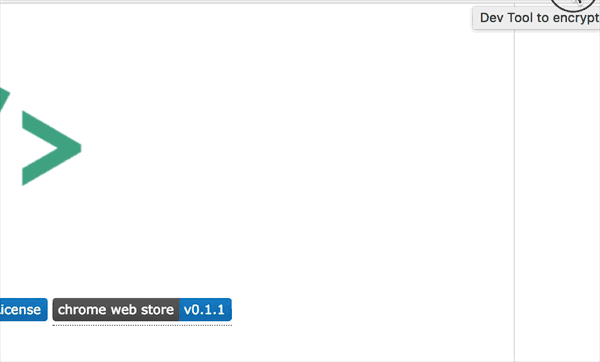

  
   
  
  
  
  

<h1 align="center">Dev Tool</h1>

`Dev Tool`是chrome下的一个小插件，使用`vue2`开发，方便开发时进行一些编码、进制转换、正则测试以及hash加密，目前在开发中，功能持续添加。

### Demo

### 目前实现功能
- Base64编／解码
- URL编／解码
- Unicode编／解码
- Hex编／解码
- Rot13加／解密
- Morse加／解密
- hash加密
- 正则测试
